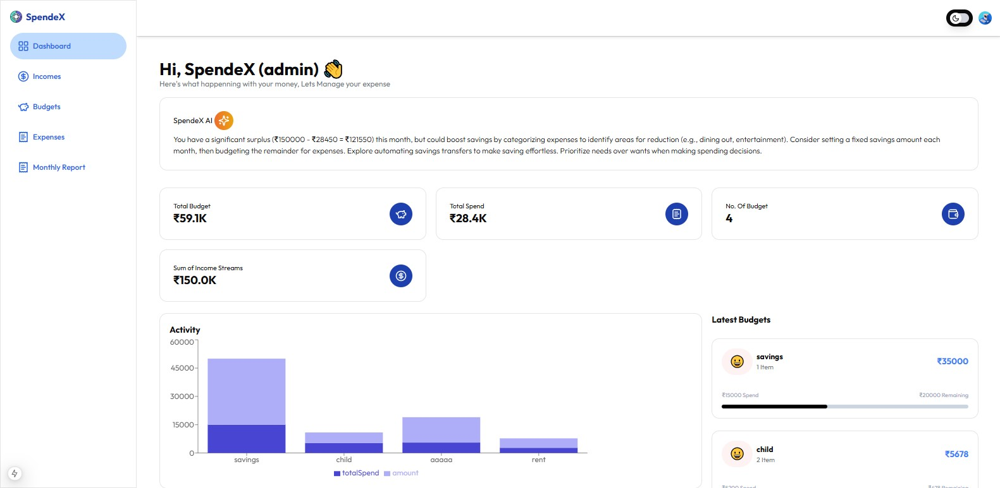

# 🏦 SpendeX - AI-Powered Expense Tracker

SpendeX is an AI-driven expense tracking and financial management web app that helps users **track, analyze, and optimize** their spending habits. Built using **Next.js, Clerk Authentication, Neon DB, and AI-powered financial insights**, SpendeX makes personal finance management **smart and effortless**.  

---

## 🚀 Features  

✅ **User Authentication:** Secure sign-in & sign-up using **Clerk**  
✅ **Track Expenses:** Add, edit, and delete expenses effortlessly  
✅ **Budget Management:** Set budgets and track spending in real-time  
✅ **AI Financial Advice:** Uses **Gemini AI** to offer personalized financial tips  
✅ **Interactive Dashboard:** View expenses in **graphs and charts**  
✅ **Mobile & Responsive:** Works smoothly on all devices  
✅ **Secure & Private:** Your data is stored safely using **NeonDB**  

---

## 🛠️ Tech Stack  

- **Frontend:** Next.js, React, Tailwind CSS  
- **Backend:** Node.js, Neon DB, Clerk Authentication  
- **AI Integration:** Google Gemini API  
- **State Management:** React Hooks  
- **UI Components:** ShadCN, Lucide Icons  

---

## 🎯 How to Install & Run  

🔹 **1. Clone the Repository**  

git clone https://github.com/Sathishbhupa/SpendeX.git
cd SpendeX

🔹 2. Install Dependencies

npm install

🔹 3. Setup Environment Variables

Create a .env.local file and add the following:

NEXT_PUBLIC_CLERK_PUBLISHABLE_KEY=your_clerk_key

CLERK_SECRET_KEY=..........

NEXT_PUBLIC_CLEARK_SIGN_IN_URL='/app/auth/sign-in'

NEXT_PUBLIC_CLEARK_SIGN_UP_URL='/app/auth/sign-up'

NEXT_PUBLIC_CLEARK_AFTER_SIGN_IN_URL='/dashboard'

NEXT_PUBLIC_CLEARK_AFTER_SIGN_UP_URL='/dashboard'

NEXT_PUBLIC_DATABASE_URL=your_database_url_key

NEXT_PUBLIC_AI_API_KEY=your_AIapi_key

  

🔹 4. Start the Development Server

npm run dev

The app will be available at http://localhost:3000

📸 Screenshots

🚀 

🤝 Contributing

We welcome contributions! Feel free to fork the repo, create a branch, and submit a PR.

📜 License

This project is open-source and available under the MIT License.

📩 Contact

For queries, reach out to:

📧 Email: sathishbhupa522@gmail.com  

🌐 GitHub: Sathishbhupa

